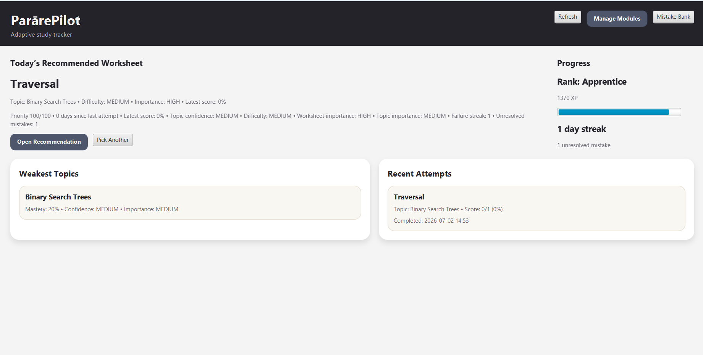
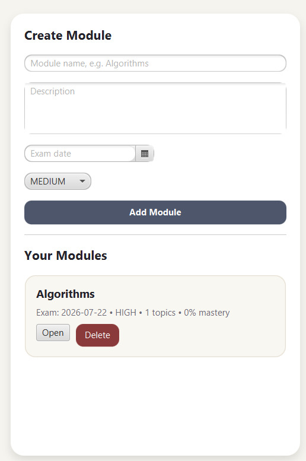
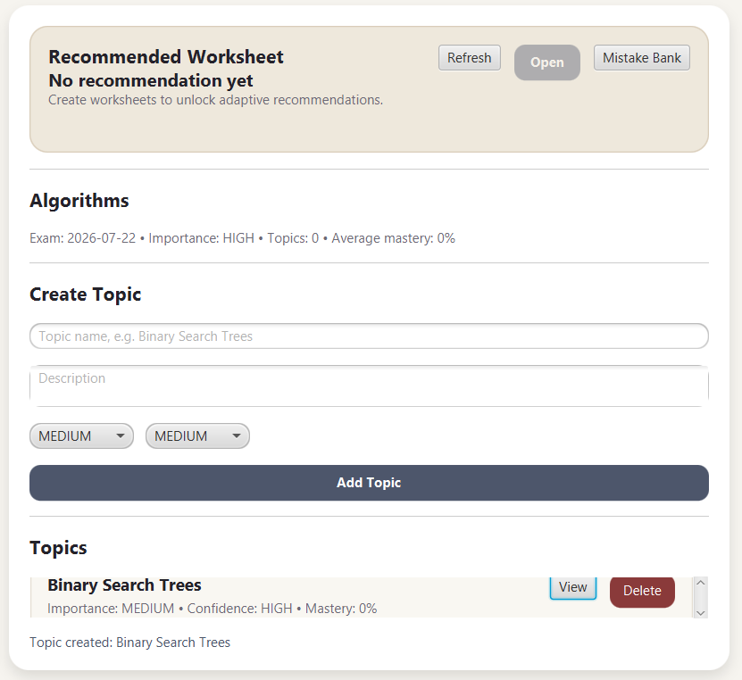
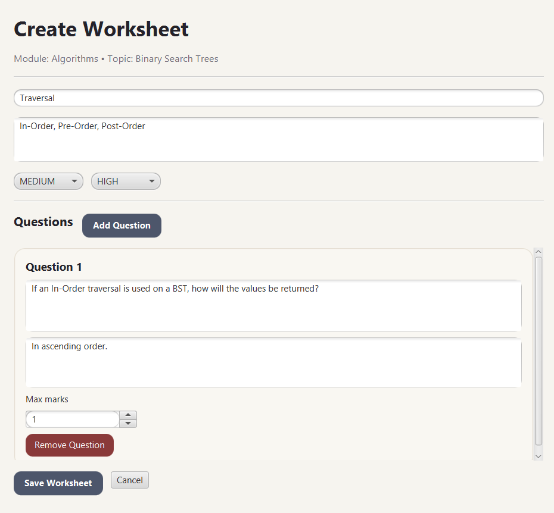
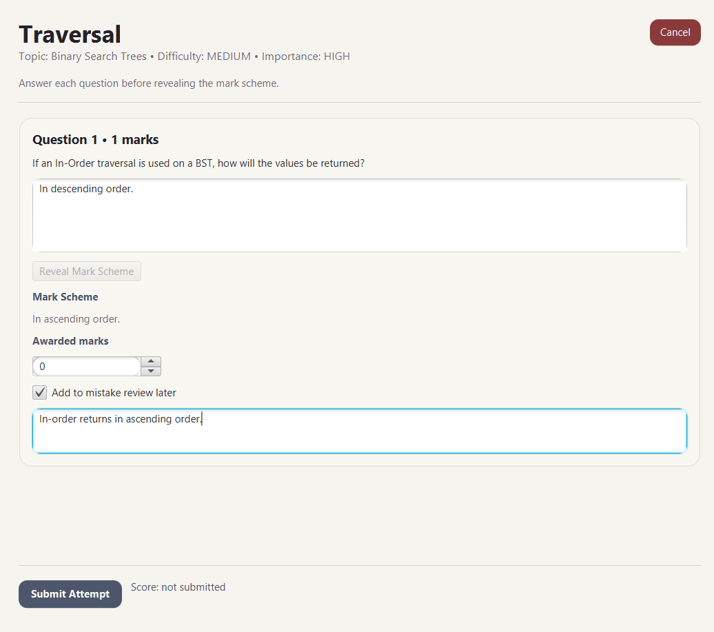
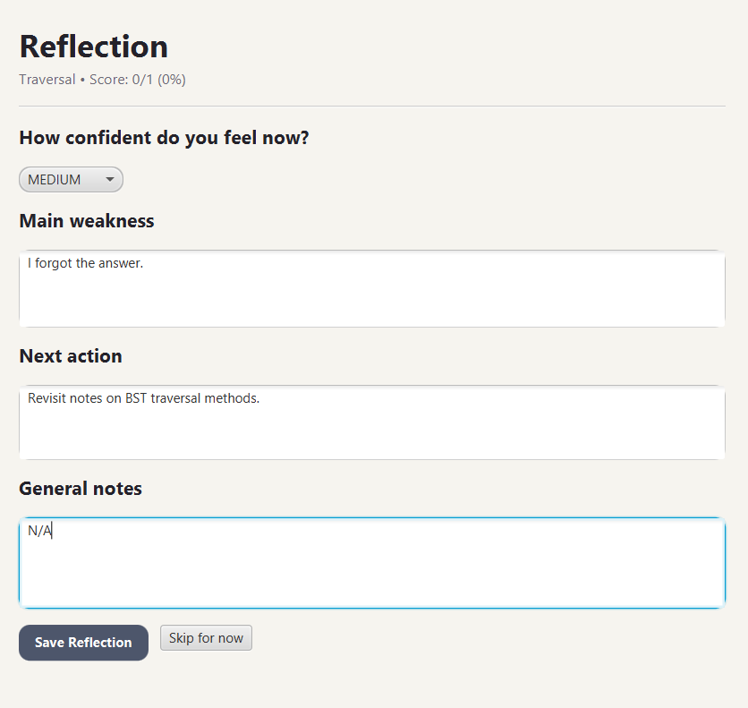
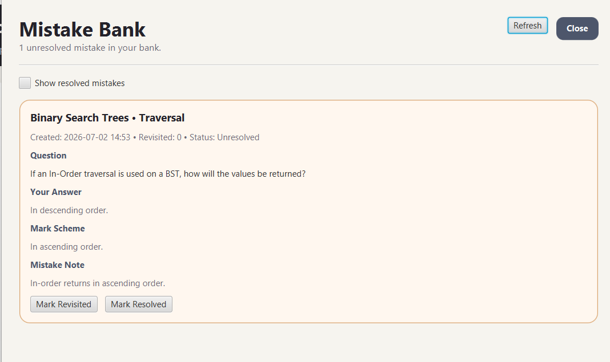

# ParārePilot

**ParārePilot** is a local-first JavaFX study tracker for organising revision material, attempting worksheets, recording mistakes, and getting adaptive worksheet recommendations.

The app is built around a simple idea:

> Pick something useful, but keep revision unpredictable.

ParārePilot stores modules, topics, worksheets, questions, attempts, reflections, mistakes, XP, streaks, and recommendations in a local SQLite database.

---

## Status

V1 is complete.

Current features include:

| Area               | Included                                                                           |
| ------------------ | ---------------------------------------------------------------------------------- |
| Study organisation | Module and topic management                                                        |
| Worksheet creation | Manual worksheet creation                                                          |
| Question storage   | Question prompts, mark schemes, and maximum marks                                  |
| Attempts           | In-app worksheet attempt flow                                                      |
| Marking            | Self-marking after revealing mark schemes                                          |
| Reflection         | Post-attempt confidence, weakness, notes, and next action                          |
| Progress tracking  | Topic mastery and worksheet statistics                                             |
| Mistakes           | Mistake bank with unresolved and resolved items                                    |
| Gamification       | XP, ranks, and streaks                                                             |
| Recommendations    | Adaptive weighted worksheet selection                                              |
| Dashboard          | Recommended worksheet, weak topics, recent attempts, XP, streak, and mistake count |
| Persistence        | Local SQLite database storage                                                      |

Planned work includes FlightDeck API integration, generated worksheets, improved analytics, import/export, search, and theme support.

---

## Screenshots

### Dashboard



### Modules



### Topic Detail



### Worksheet Detail



### Attempt Flow



### Reflection



### Mistake Bank



---

## How It Works

ParārePilot turns revision into a repeatable loop.

| Step | Action                          |
| ---- | ------------------------------- |
| 1    | Create study material           |
| 2    | Attempt worksheets              |
| 3    | Self-mark answers               |
| 4    | Reflect on weaknesses           |
| 5    | Store mistakes                  |
| 6    | Update topic mastery            |
| 7    | Recommend what to practise next |

Recommendations are based on worksheet age, recent scores, topic confidence, difficulty, importance, failure streaks, and unresolved mistakes.

The app does not always select the single highest-priority worksheet. Instead, it uses weighted randomness so weaker areas appear more often without making the recommendations feel fixed.

---

## Features

### Module and Topic Management

Users can create modules and topics to organise their study material.

Each topic tracks:

| Field              | Description                                  |
| ------------------ | -------------------------------------------- |
| Importance         | How important the topic is                   |
| Confidence         | How confident the user feels about the topic |
| Mastery score      | Current estimated mastery                    |
| Related worksheets | Worksheets attached to the topic             |
| Related mistakes   | Mistakes attached to the topic               |

---

### Manual Worksheet Creation

Users can create worksheets from lectures, tutorials, past papers, or personal notes.

Each worksheet contains:

| Field         | Description                          |
| ------------- | ------------------------------------ |
| Title         | Worksheet name                       |
| Description   | Optional worksheet summary           |
| Difficulty    | Easy, medium, or hard                |
| Importance    | Revision importance                  |
| Questions     | Worksheet questions                  |
| Mark schemes  | Expected answers or marking guidance |
| Maximum marks | Marks available for each question    |

---

### Worksheet Attempts

Users can attempt worksheets inside the app.

Each question supports:

| Feature            | Description                                                     |
| ------------------ | --------------------------------------------------------------- |
| Answer field       | Text area for the user's answer                                 |
| Mark scheme reveal | Shows the mark scheme after the user has attempted the question |
| Self-awarded marks | Lets the user mark their own answer                             |
| Mistake checkbox   | Marks the answer as a mistake                                   |
| Mistake note       | Records what went wrong                                         |

---

### Reflection and Stats

After an attempt, the user completes a short reflection.

| Field                    | Description                        |
| ------------------------ | ---------------------------------- |
| Confidence after attempt | Updated confidence level           |
| Main weakness            | Main problem area from the attempt |
| Next action              | What to do next                    |
| General notes            | Additional notes about the attempt |

After reflection, the app updates:

| Data                     | Description                   |
| ------------------------ | ----------------------------- |
| Worksheet latest score   | Most recent score             |
| Worksheet average score  | Average score across attempts |
| Worksheet attempt count  | Number of completed attempts  |
| Worksheet failure streak | Consecutive failed attempts   |
| Topic confidence         | Updated topic confidence      |
| Topic mastery            | Updated topic mastery score   |

---

### Mistake Bank

Answers marked as mistakes are saved to the mistake bank.

Each mistake record contains:

| Field           | Description                                   |
| --------------- | --------------------------------------------- |
| Topic           | Linked topic                                  |
| Worksheet       | Linked worksheet                              |
| Question prompt | Original question                             |
| User answer     | Submitted answer                              |
| Mark scheme     | Expected answer or marking guidance           |
| Mistake note    | User-written note about the mistake           |
| Created date    | Date the mistake was recorded                 |
| Resolved status | Whether the mistake has been resolved         |
| Revisit count   | Number of times the mistake has been reviewed |

---

### Gamification

ParārePilot uses a lightweight XP and rank system.

XP is awarded for:

| Action                | Description                     |
| --------------------- | ------------------------------- |
| Completing worksheets | Rewards regular practice        |
| Scoring 70%+          | Rewards solid performance       |
| Scoring 90%+          | Rewards strong performance      |
| Completing reflection | Rewards review after practice   |
| Reviewing mistakes    | Rewards returning to weak areas |

Ranks:

| Rank       | XP Required |
| ---------- | ----------: |
| Novice     |        0 XP |
| Apprentice |      500 XP |
| Scholar    |     1500 XP |
| Specialist |     3000 XP |
| Master     |     5000 XP |

---

### Dashboard

The dashboard shows the user's current revision state.

| Item                     | Description                            |
| ------------------------ | -------------------------------------- |
| Recommended worksheet    | Next suggested worksheet               |
| Priority explanation     | Reason for the recommendation          |
| XP and rank              | Current XP progress                    |
| Streak                   | Current practice streak                |
| Unresolved mistake count | Number of mistakes still open          |
| Weakest topics           | Topics that need attention             |
| Recent attempts          | Recent worksheet activity              |
| Navigation buttons       | Access to modules and the mistake bank |

---

## Adaptive Weighted Selection

ParārePilot assigns each eligible worksheet a priority score.

The score uses:

| Factor                   | Effect                                        |
| ------------------------ | --------------------------------------------- |
| Age since last attempt   | Older worksheets become more likely to appear |
| Latest score             | Lower-scoring worksheets receive a boost      |
| Topic confidence         | Low-confidence topics receive a boost         |
| Worksheet difficulty     | Difficulty affects priority                   |
| Worksheet importance     | Important worksheets receive a boost          |
| Topic importance         | Important topics increase worksheet priority  |
| Failure streak           | Repeated failures increase priority           |
| Unresolved mistake count | Linked unresolved mistakes increase priority  |

The app then performs weighted-random selection.

This means a weak worksheet is more likely to appear, but it is not guaranteed every time.

More detail is available in:

```text
docs/weighted-selection.md
```

---

## Architecture

ParārePilot uses a layered JavaFX architecture.

| Layer                     | Responsibility                             |
| ------------------------- | ------------------------------------------ |
| JavaFX FXML + Controllers | Screens, input handling, and display logic |
| Service Layer             | Application rules and workflow logic       |
| Repository Layer          | Database access through JDBC               |
| SQLite Database           | Local application data                     |

---

### Model Layer

The model layer contains plain Java records and enums.

| Model              | Description                                |
| ------------------ | ------------------------------------------ |
| `StudyModule`      | Study module                               |
| `Topic`            | Topic inside a module                      |
| `Worksheet`        | Worksheet attached to a topic              |
| `Question`         | Question inside a worksheet                |
| `WorksheetAttempt` | Completed or in-progress worksheet attempt |
| `Answer`           | User answer for a question                 |
| `MistakeBankItem`  | Stored mistake                             |
| `UserStats`        | XP, streaks, and user progress             |

---

### Repository Layer

The repository layer handles SQLite persistence through JDBC.

| Repository            | Description                             |
| --------------------- | --------------------------------------- |
| `ModuleRepository`    | Stores and retrieves modules            |
| `TopicRepository`     | Stores and retrieves topics             |
| `WorksheetRepository` | Stores and retrieves worksheets         |
| `QuestionRepository`  | Stores and retrieves questions          |
| `AttemptRepository`   | Stores and retrieves worksheet attempts |
| `AnswerRepository`    | Stores and retrieves answers            |
| `MistakeRepository`   | Stores and retrieves mistake bank items |
| `UserStatsRepository` | Stores and retrieves user statistics    |

---

### Service Layer

The service layer contains the main application logic.

| Service                     | Description                          |
| --------------------------- | ------------------------------------ |
| `WorksheetSelectionService` | Selects recommended worksheets       |
| `PriorityScoreService`      | Calculates worksheet priority scores |
| `AttemptService`            | Handles worksheet attempts           |
| `ReflectionService`         | Handles post-attempt reflection      |
| `TopicStatsService`         | Updates topic confidence and mastery |
| `GamificationService`       | Handles XP, ranks, and streaks       |
| `DashboardService`          | Provides dashboard data              |

---

### UI Layer

The UI layer contains JavaFX FXML screens and controllers.

| View                        | Description                 |
| --------------------------- | --------------------------- |
| `DashboardView.fxml`        | Main dashboard              |
| `ModulesView.fxml`          | Module and topic management |
| `TopicDetailView.fxml`      | Topic details               |
| `WorksheetDetailView.fxml`  | Worksheet details           |
| `AttemptWorksheetView.fxml` | Worksheet attempt screen    |
| `ReflectionView.fxml`       | Post-attempt reflection     |
| `MistakeBankView.fxml`      | Mistake bank                |

More detail is available in:

```text
docs/architecture.md
```

---

## Tech Stack

| Technology | Use                             |
| ---------- | ------------------------------- |
| Java 21    | Main language and runtime       |
| JavaFX 21  | Desktop UI                      |
| Maven      | Build and dependency management |
| SQLite     | Local database                  |
| JDBC       | Database access                 |
| JUnit 5    | Testing                         |
| CSS        | JavaFX styling                  |

---

## Local Data Storage

ParārePilot stores its SQLite database locally.

Default location:

```text
~/.pararepilot/appdata.db
```

The database is created automatically when the app starts.

---

## Running Locally

### Requirements

| Requirement | Use                                 |
| ----------- | ----------------------------------- |
| Java 21     | Compile and run the application     |
| Maven       | Build, test, and launch the project |

Check installed versions:

```bash
java --version
mvn --version
```

### Clone the Repository

```bash
git clone https://github.com/izuchukwucur-sudo/parare-pilot.git
cd parare-pilot
```

### Run Tests

```bash
mvn clean test
```

### Start the App

```bash
mvn javafx:run
```

---

## V1 Feature List

| Feature                                                                   | Status   |
| ------------------------------------------------------------------------- | -------- |
| Create modules and topics                                                 | Complete |
| Create worksheets with questions and mark schemes                         | Complete |
| Attempt worksheets inside the app                                         | Complete |
| Reveal mark schemes                                                       | Complete |
| Self-mark answers                                                         | Complete |
| Complete reflection after attempts                                        | Complete |
| Update worksheet stats                                                    | Complete |
| Update topic mastery                                                      | Complete |
| Store mistakes                                                            | Complete |
| Review and resolve mistakes                                               | Complete |
| Recommend worksheets using weighted randomness                            | Complete |
| Display XP, rank, streak, mistake count, weak topics, and recent attempts | Complete |
| Persist data locally with SQLite                                          | Complete |

---

## Planned Features

| Feature                     | Notes                                                      |
| --------------------------- | ---------------------------------------------------------- |
| FlightDeck API integration  | Generate worksheets from structured prompts                |
| Generated worksheet preview | Review generated worksheets before saving                  |
| Boss worksheets             | Larger challenge-style revision sessions                   |
| Revenge question sessions   | Revisit previously failed questions                        |
| Search and filters          | Find modules, topics, worksheets, and mistakes more easily |
| JSON import/export          | Back up and move data                                      |
| Attempt export              | Export completed worksheet attempts                        |
| Theme system                | Add visual customisation                                   |
| Improved analytics          | Show more detailed progress data                           |
| Cloud sync                  | Optional cross-device data sync                            |
| Tutor mode                  | Support guided review workflows                            |

---

## Related Project

ParārePilot is designed to work with **FlightDeck API**, a separate worksheet-generation API.

FlightDeck API generates structured revision material from subject, topic, difficulty, question count, and format inputs.

| Project        | Role                         |
| -------------- | ---------------------------- |
| ParārePilot    | Offline JavaFX study tracker |
| FlightDeck API | Worksheet-generation API     |
