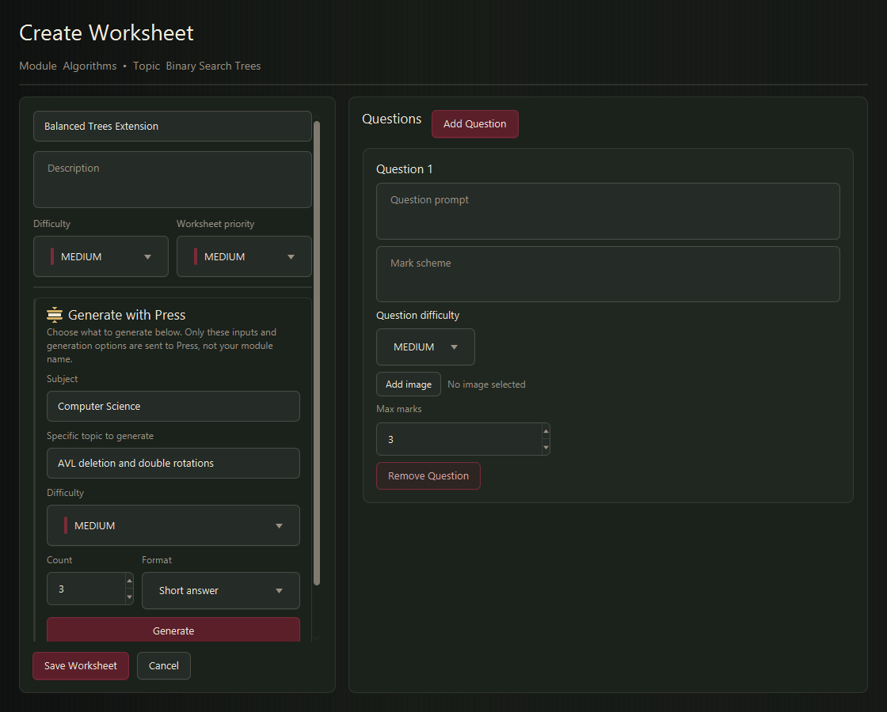

# Commonplace

Commonplace is a local-first desktop study app for building worksheets, practising with active recall, reviewing mistakes, and deciding what to study next.

Study records stay in a local SQLite database. An internet connection is required only when generating a worksheet with the optional Press service.


## The study loop

1. Create a module and add the topics you are studying.
2. Create a worksheet manually, generate an editable draft with Press, or import a PDF.
3. Answer every question before revealing its mark scheme and self-mark the attempt.
4. Save useful mistakes and optionally reflect on what to do next.
5. Return to the dashboard for the next recommendation and review schedule.

Commonplace deliberately keeps mastery, XP, and recommendations separate:

| Measure | What it represents |
| --- | --- |
| Mastery | A conservative estimate of retained knowledge, supported by visible evidence |
| XP | Novel and meaningful study activity, not academic ability |
| Recommendation priority | The best available saved worksheet for the learner's current needs |

## Features

- Local accounts, remembered sessions, password changes, and account switching.
- Modules and topics with exam dates, importance, confidence, and evidence-based mastery.
- Manual worksheet creation with question-level marks, difficulty, mark schemes, and optional images.
- Press generation for editable short-answer or long-answer worksheet drafts.
- Local PDF import with text extraction, image extraction, and optional local OCR.
- Structured attempts that require answers to be locked before the mark scheme is revealed.
- Self-marking, assistance tracking, mistake notes, and optional post-attempt reflection.
- A mistake bank with active-recall review, assistance tracking, and resolved states.
- Deterministic recommendations based on learning need, retention, evidence strength, difficulty fit, importance, exam urgency, variety, and mistake risk.
- A dashboard with recommendations, reminders, study habit, XP, session streaks, recent attempts, weak topics, and an exam calendar.
- Dark and light themes, four accent palettes, compact layout, font sizing, reduced motion, higher contrast, and larger controls.
- Per-account study, reminder, recommendation, gamification, and data controls.

## Screens

| Manage modules | Topic evidence |
| --- | --- |
|  |  |

| Create a worksheet | Attempt a worksheet |
| --- | --- |
|  |  |

The [user guide](docs/user-guide.md) contains the complete, current screenshot gallery and a walkthrough of every workflow.

## Requirements

- Java 21
- Maven

Check the installed versions:

```bash
java --version
mvn --version
```

## Run from source

```bash
git clone https://github.com/curtis-izuchukwu/commonplace.git
cd commonplace
mvn javafx:run
```

The database and copied question images are created automatically on first use.

## Worksheet creation

### Manual

Add questions directly in the editor. Each question has a prompt, editable mark scheme, maximum mark value, assessed difficulty, and optional PNG or JPEG image.

### Press

The Press panel asks for a subject and a specific generation topic. These fields are deliberately independent of the module and topic used to organise the saved worksheet. Commonplace sends only the values entered in the Press panel and the selected generation options.

Supported options:

- 1 to 10 questions;
- easy, medium, or hard difficulty;
- short-answer or long-answer format.

Generated questions, model answers, and individual marking points remain editable before saving. Generated content should always be reviewed for accuracy.

The default Press endpoint is:

```text
https://press-api.izuchukwucur.workers.dev
```

Override the base URL, without `/generate`, using either setting below. The JVM system property takes precedence.

| Setting | Example |
| --- | --- |
| JVM property | `-Dcommonplace.press.baseUrl=https://example.test` |
| Environment variable | `COMMONPLACE_PRESS_API_BASE_URL=https://example.test` |

Generation runs on a background task with a 10-second connection timeout and a 90-second request timeout. Stopping generation preserves the current draft. Once saved, a Press worksheet is fully local and uses the same attempt and review flow as every other worksheet.

### PDF import

PDF import extracts selectable text and embedded images locally, then opens an editable review screen. For image-only documents, Commonplace tries Tesseract first and Windows OCR second when either is available. Import quality depends on the source document, so every draft must be reviewed before saving.

## Learning and recommendations

Commonplace estimates mastery from question-level evidence rather than a single worksheet score. Marks, assessed difficulty, independent recall, assistance, active time, prompt repetition, spacing, retention, consistency, and breadth all influence the estimate. Repeating the same prompts on the same day contributes very little new evidence.

The recommendation engine considers only saved worksheets that contain questions and fall within the configured difficulty range. Completing a worksheet removes it from the recommendation pool for the rest of that day. Once the daily worksheet goal is met, the dashboard shows the next refresh countdown; manually opened worksheets remain available.

See [Automatic mastery, XP, and recommendations](docs/learning-model.md) for the complete model and its safeguards.

## Local data and backups

The default application directory is:

```text
~/.commonplace/
```

| Path | Purpose |
| --- | --- |
| `~/.commonplace/appdata.db` | Accounts, study structure, attempts, learning evidence, XP, and settings |
| `~/.commonplace/images/` | Copied question images and images extracted from PDFs |
| `~/.commonplace/appdata.before-learning-v1.db` | One-time safety copy created before the first learning-schema migration of an older database |

Settings can export or import the SQLite database. Import replaces the current database and returns to sign-in. The database export does not bundle the `images` directory, so copy that directory separately when a backup must include question images.

For isolated development or test profiles, set the JVM property `commonplace.data.dir` to a dedicated directory.

## Build and test

Compile and package:

```bash
mvn clean package
```

Run the default automated suite:

```bash
mvn test
```

Maven isolates automated test data under `target/test-data`; it does not use the normal Commonplace profile.

JavaFX UI tests require a desktop display and are opt-in:

```bash
mvn test "-Dcommonplace.uiTest=true"
```

The live Press test sends synthetic topics to the deployed service and is also opt-in:

```bash
mvn test "-Dcommonplace.uiTest=true" "-Dcommonplace.press.liveTest=true"
```

Regenerate the documentation gallery from the current FXML and a disposable sample account:

```bash
mvn test "-Dcommonplace.docs.screenshots=true" "-Dtest=DocumentationScreenshotTest" "-Dcommonplace.data.dir=target/docs-data"
```

## Documentation

- [User guide](docs/user-guide.md)
- [Automatic mastery, XP, and recommendations](docs/learning-model.md)
- [Architecture](docs/architecture.md)

## Current limitations

- Account deletion is not implemented. Individual account study data can be cleared from Settings.
- Cloud sync and multi-device conflict resolution are not available.
- Database backups do not include copied question images.
- PDF parsing and OCR can require manual correction.
- Press generation requires network access; all other core study workflows are local.

## Technology

Java 21, JavaFX 21, SQLite through JDBC, Apache PDFBox, Maven, and JUnit 5.

## License

Commonplace is released under the [MIT License](LICENSE).
