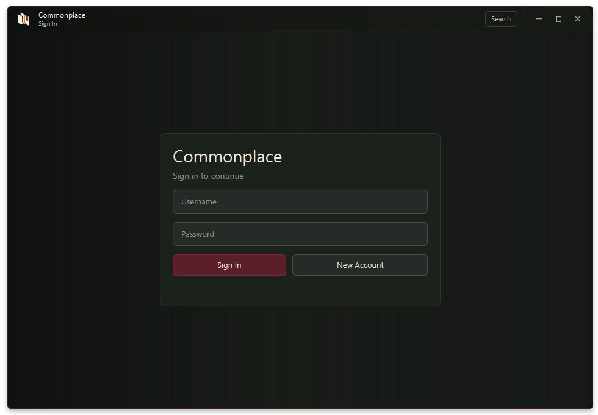
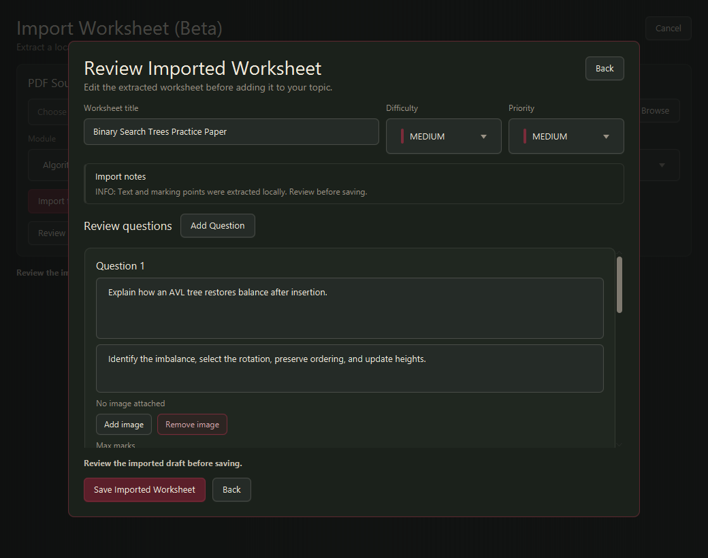
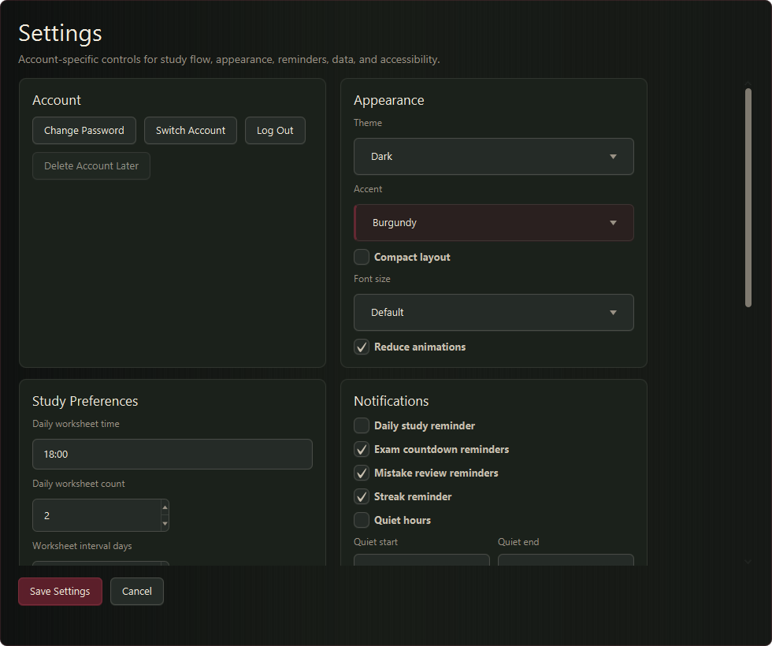

# Commonplace User Guide

Commonplace organises revision around evidence: create material, attempt it honestly, review errors, and return when the material is due again. The app stores its records locally and does not require a syllabus or learning-outcome setup.

## Sign in and accounts

Create a local account with a username and password, or sign in to an existing account. Accounts share the same database file but keep modules, topics, attempts, settings, recommendations, and statistics separate.

The account menu provides Settings, Change Password, Switch Account, and Log Out. Account deletion is not currently available; Settings can clear the signed-in account's study data without removing the account itself.

## Dashboard

The dashboard brings together the next recommendation, reminders, study record, exam calendar, weak topics, and recent attempts.

### Recommended worksheet

The recommendation card names one saved worksheet and explains why it was selected. Status badges call attention to conditions such as a due review, limited evidence, or an approaching exam. Difficulty and priority are shown separately.

- **Open worksheet** opens the recommended worksheet.
- **Pick another** advances to another ranked worksheet where one is available.
- A worksheet completed today is not recommended again that day.
- Completing the configured daily goal pauses recommendations and shows a countdown to the next refresh.
- If no eligible worksheet exists, the card explains that a worksheet must be added or the difficulty range adjusted.

The recommendation is guidance, not a restriction. Any saved worksheet can still be opened from its topic.

### Study record

XP and study-habit labels describe activity and consistency. They do not alter mastery. A session streak advances when the daily goal is completed within the configured worksheet interval.

### Reminders and exams

Dashboard reminders respect their individual Settings toggles and quiet hours. Exam dates appear in the calendar and increase recommendation urgency as they approach. Modules with past exam dates can be excluded from recommendations by enabling **Archive completed modules**.

### Quick navigation

The **Search** button in the title bar opens a searchable list of the pages and actions available from the dashboard. Type to filter, press Enter to open the first result, or press Escape to close it.

## Modules and topics

Modules are the broad subjects or courses being studied. Topics divide a module into meaningful areas of practice.

For each module, enter:

- a name;
- an optional description;
- an optional exam date;
- low, medium, or high priority.

For each topic, enter a name, optional description, priority, and current confidence. Confidence is a learner judgement; mastery is calculated separately from evidence.

Module cards use a compact study ledger for exam date, topic count, mastery, and priority. Topic cards show stable record values in stat cells. A mastery cell fills proportionally to its percentage.

Deleting a module also removes its topics, worksheets, attempts, mistakes, and related evidence. Deleting a topic removes the same records beneath that topic.

## Topic details and mastery

Open a topic to see its mastery estimate, evidence summary, description, and worksheets.

The mastery percentage is intentionally conservative. A high score on one short worksheet can establish strong recent performance without proving broad mastery of the whole topic.

Expand **View supporting evidence** to inspect:

- recent score;
- estimated retention;
- distinct questions;
- distinct worksheets;
- distinct study areas;
- distinct study days;
- the next review date.

Evidence is labelled **Limited**, **Developing**, or **Established** according to its breadth and strength. Repeated prompts are discounted automatically.

## Creating worksheets

Every worksheet belongs to one local topic. It has a title, optional description, difficulty, priority, and one or more questions.

Each question supports:

- a prompt;
- an editable mark scheme;
- maximum marks;
- an assessed difficulty;
- one optional PNG or JPEG image.

### Manual creation

Enter the worksheet details, add or remove question cards, and save when every question has a prompt and valid maximum mark value. Mark schemes remain editable and may be left blank when the learner intends to assess the question another way.

### Generate with Press

Press creates an editable worksheet draft. Enter the **Subject** and **Specific topic to generate** in the Press panel, then choose difficulty, question count, and answer format.

The module name and the saved Commonplace topic are not sent automatically. Only the text entered in the Press panel and the selected generation options are sent to Press. This lets a worksheet remain organised under a broad local topic while requesting narrow practice such as “AVL deletion and double rotations.”

Press can generate 1 to 10 short-answer or long-answer questions. Commonplace preserves the returned model answer and individual marking points in the editable mark scheme. Review all generated material before saving.

Generation can be stopped without discarding the current draft. Network, validation, rate-limit, and service errors appear in the editor so the worksheet can be retried or completed manually.

### Import from PDF

Choose **Import from PDF (Beta)** from a topic, select the PDF, and review the extracted worksheet before saving.

The review screen allows the title, difficulty, priority, questions, mark schemes, marks, and image assignments to be corrected. Selectable text and images are extracted locally. Image-only documents use a local OCR engine when Tesseract or Windows OCR is available.

PDF layouts vary considerably. Treat the imported result as a draft, especially when the source uses columns, scanned pages, complex diagrams, or unusual question numbering.

## Worksheet details

The worksheet detail screen shows stable metadata, the recommendation explanation when applicable, and the complete question and mark-scheme record.

Use **Start Attempt** when ready to answer. Viewing a worksheet does not award XP or change mastery.

## Attempting a worksheet

For each question:

1. Write an answer without viewing the mark scheme.
2. Choose **Lock answer and self-mark**.
3. Compare the locked answer with the revealed mark scheme.
4. Enter the awarded marks.
5. Optionally add the question to the mistake bank with a short note.

**Use mark scheme as a hint** is available when support is needed. Assisted answers remain useful practice, but they receive less mastery evidence and XP than independent recall.

An attempt cannot be submitted until every worksheet question has a valid answer and mark allocation. Submission saves the complete attempt, answers, mistakes, worksheet statistics, learning evidence, and practice XP together.

## Reflection

Reflection is optional and appears after an attempt has already been saved safely.

Record current confidence, the main weakness, a concrete next action, and optional notes. A meaningful reflection can earn a small one-time XP reward. Skipping, submitting empty text, or saving the same reflection again does not create repeat rewards.

## Mistake bank

Questions marked during an attempt appear in the mistake bank.

**Recall and review** asks for a fresh answer before showing the saved answer and mark scheme. Successful unassisted recall can add evidence, resolve the mistake, and award limited review XP. A hint-assisted review is recorded but does not count as independent recall. Mistakes can also be marked resolved or unresolved manually.

## Settings

Settings are stored per account.

### Appearance

- Dark, light, or system theme
- Brass, graphite, forest, or burgundy accent
- Compact layout
- Small, default, or large text
- Reduced animations

### Study preferences

- Daily worksheet goal
- Worksheet refresh interval from 1 to 30 days
- Preferred minimum and maximum worksheet difficulty
- Balanced, weak-topics, or upcoming-exams recommendation focus
- Optional inclusion of resolved mistakes in recommendation risk
- Reset of today's recommendation history

The daily goal counts distinct worksheets. Repeating the same worksheet does not fill multiple goal slots.

### Notifications

Daily study, exam countdown, mistake review, and streak reminders can be enabled independently. Quiet hours suppress dashboard reminders during the configured time range.

### Gamification

XP visibility, streak tracking, and completion celebrations can be switched on or off. Resetting gamification clears XP and streak progress without deleting worksheets or attempts.

### Modules and data

Set the default module priority, archive modules whose exam dates have passed, export the database, import a database backup, or clear the current account's study data.

### Accessibility

Higher contrast and larger controls can be enabled independently of the selected theme and font size.

## Backups and local files

Commonplace stores its database and copied images under `~/.commonplace/` by default.

- **Export Data** copies the SQLite database to a chosen `.db` file.
- **Import Backup** replaces the current database and returns to sign-in.
- **Clear Local Data** removes modules, topics, worksheets, attempts, mistakes, recommendation history, XP events, and study statistics for the signed-in account.

Database export does not include the `~/.commonplace/images/` directory. Copy that directory separately when backing up worksheets that contain question images.

## Troubleshooting

### Press is unavailable

Check the internet connection and try again. A rate-limit response may require a short wait. Manual creation and saved worksheets continue to work offline.

### A PDF imports poorly

Confirm that the file contains selectable text. If it is a scan, install Tesseract or use Windows with an available Windows OCR language. Correct the resulting draft before saving.

### A question image is missing

Images are stored separately from the database. Restore the matching `images` directory or replace the image in the worksheet draft.

### A repeated worksheet awards little or no XP

This is expected when the same prompts are repeated too soon, the attempt relied heavily on assistance, or a daily/category cap has been reached. The attempt and mastery evidence are still saved.

### Mastery is lower than the latest score

The latest score measures one attempt. Mastery also requires breadth, independent recall, spacing, retention, and consistent performance across the topic.
